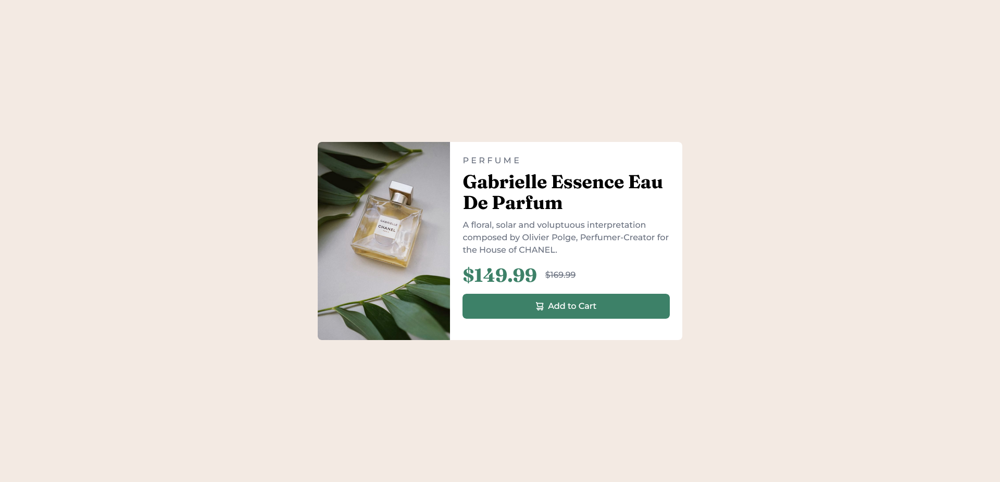

# Frontend Mentor - Product preview card component solution

This is a solution to the [Product preview card component challenge on Frontend Mentor](https://www.frontendmentor.io/challenges/product-preview-card-component-GO7UmttRfa).

## Table of contents

- [Overview](#overview)
  - [Screenshot](#screenshot)
  - [Links](#links)
- [My process](#my-process)
  - [Built with](#built-with)
- [Author](#author)

**Note: Delete this note and update the table of contents based on what sections you keep.**

## Overview

### Screenshot

### Links

- Solution URL: [https://github.com/Beefsupreme21/Proudct-Preview-Component](https://github.com/Beefsupreme21/Proudct-Preview-Component)
- Live Site URL: [https://beefsupreme21.github.io/Product-Preview-Component/](https://beefsupreme21.github.io/Product-Preview-Component/)

## My process

### Built with

- HTML5
- Tailwind CSS
- Flexbox
- Mobile-first workflow

## Author

- Frontend Mentor - [@Beefsupreme21](https://www.frontendmentor.io/profile/Beefsupreme21)